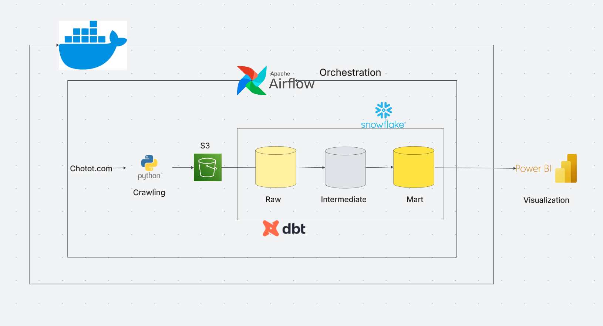
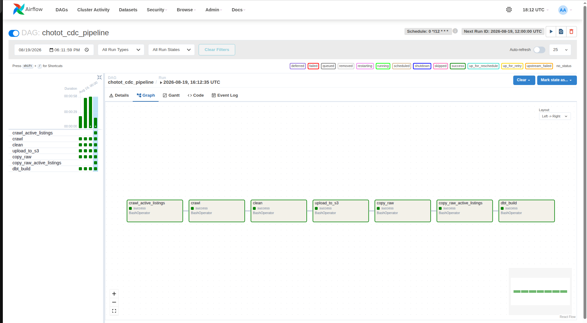
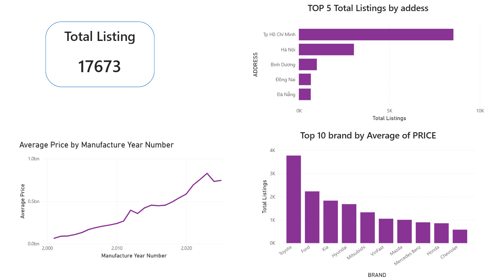

# Chotot Used Car Data Pipeline

An end-to-end data engineering pipeline deployed on AWS EC2 that collects used-car listings from Chotot, stores raw data in Amazon S3, transforms it in Snowflake with dbt, orchestrates scheduled runs with Apache Airflow, and visualizes the current market in Power BI.



## Overview

This project builds an automated pipeline for analyzing used-car listings. It runs every 12 hours, captures currently active listings, cleans and uploads the data as Parquet files, then builds analytics-ready Snowflake tables.

The pipeline keeps two complementary views of the data:

- A current inventory of active car listings for market analysis.
- Historical listing versions and price-change events for future CDC analysis.

## Tech Stack

- **Python**: web crawling, data cleaning, and S3 uploads
- **Amazon S3**: raw Parquet data lake
- **Snowflake**: cloud data warehouse
- **dbt**: staging, intermediate, snapshot, and mart transformations
- **Apache Airflow**: pipeline scheduling and orchestration
- **Docker Compose**: reproducible local runtime
- **AWS EC2**: cloud host for the containerized pipeline
- **Power BI**: reporting and visualization

## Data Flow

```text
Chotot -> Python crawler -> Data cleaning -> Amazon S3
       -> Snowflake raw tables -> dbt models -> Power BI
```

Airflow executes the following tasks in order:

```text
crawl_active_listings
        -> crawl
        -> clean
        -> upload_to_s3
        -> copy_raw
        -> copy_raw_active_listings
        -> dbt_build
```



## dbt Models

| Layer | Models | Purpose |
| --- | --- | --- |
| Staging | `stg_car_details`, `stg_active_listings` | Rename fields, cast data types, and expose raw sources |
| Intermediate | `int_car_details_latest`, `int_current_listing_ids` | Select the latest record per listing and identify active listings |
| Snapshot | `car_details_snapshot` | Preserve historical versions of listing data |
| Mart | `dim_car_current`, `fct_listing_events` | Provide current inventory and listing price-change events |

## Dashboard

The Power BI report currently focuses on the active market, including total listings, leading brands, geographical distribution, and price patterns. CDC visuals can be expanded after more historical runs have accumulated.



## Project Structure

```text
.
|-- airflow/dags/          # Airflow DAG definitions
|-- dbt/                   # dbt project, models, snapshots, and macros
|-- docker/                # Airflow and dbt Docker images
|-- images/                # Architecture and dashboard screenshots
|-- snowflake_sql/         # Initial Snowflake and S3 setup scripts
|-- src/
|   |-- ingestion/         # Chotot crawlers
|   |-- cleaning/          # Data cleaning logic
|   `-- loading/           # Amazon S3 upload logic
|-- docker-compose.yml
`-- requirements.txt
```

## Local Setup

### 1. Prerequisites

- Docker and Docker Compose
- An Amazon S3 bucket
- A Snowflake account with a warehouse, database, role, and key-pair user
- A Snowflake storage integration that can read from the S3 bucket

### 2. Configure Snowflake

Review and run the scripts in `snowflake_sql/` in this order:

1. `ConnectS3.sql`
2. `create_raw_table.sql`

Update the S3 bucket URL and AWS IAM role ARN in the SQL scripts for your own environment before running them.

### 3. Configure environment variables

Create a local `.env` file:

```env
AWS_ACCESS_KEY_ID=your_access_key
AWS_SECRET_ACCESS_KEY=your_secret_key
AWS_DEFAULT_REGION=your_region
S3_BUCKET_NAME=your_bucket_name

SNOWFLAKE_ACCOUNT=your_account_identifier
SNOWFLAKE_USER=your_dbt_user
SNOWFLAKE_ROLE=your_dbt_role
SNOWFLAKE_DATABASE=CHOTOT_DB
SNOWFLAKE_WAREHOUSE=your_warehouse
SNOWFLAKE_SCHEMA=DBT_DEV
SNOWFLAKE_PRIVATE_KEY_PATH=/usr/app/secrets/dbt_snowflake_key.p8
```

Place the Snowflake private key at:

```text
secrets/dbt_snowflake_key.p8
```

Never commit `.env`, private keys, or AWS credentials to Git.

### 4. Build and start the services

```bash
docker compose build
docker compose up airflow-init
docker compose up -d
```

Open Airflow at [http://localhost:8080](http://localhost:8080), enable `chotot_cdc_pipeline`, and trigger it manually or wait for the scheduled run.

The DAG uses the cron schedule `0 */12 * * *`, so it runs twice per day at 00:00 and 12:00 UTC.

### 5. Verify dbt connectivity

```bash
docker compose run --rm dbt
```

## AWS EC2 Deployment

The pipeline is deployed on an AWS EC2 instance with Docker Compose. The instance runs:

- Apache Airflow webserver and scheduler
- PostgreSQL for Airflow metadata
- Python ingestion, cleaning, and loading jobs
- dbt transformations

Airflow triggers the workflow every 12 hours. The EC2 instance performs the processing and orchestration, Amazon S3 stores the raw Parquet files, and Snowflake stores and transforms the warehouse data.

The same Docker Compose workflow used locally can be started on EC2 after configuring the environment variables and Snowflake private key:

```bash
docker compose build
docker compose up airflow-init
docker compose up -d
docker compose ps
```

For security, Airflow port `8080` should be restricted to a trusted IP in the EC2 security group. Public IP addresses, SSH keys, private keys, and environment files must not be committed to the repository.

## Notes

- The dashboard represents listings observed by this crawler, not the complete Chotot vehicle market.
- `NEW_LISTING` means first observed by this pipeline; it does not guarantee that the listing was newly published on Chotot.
- This project is intended for learning and portfolio use. Follow the source website's terms and apply responsible crawl rates.
